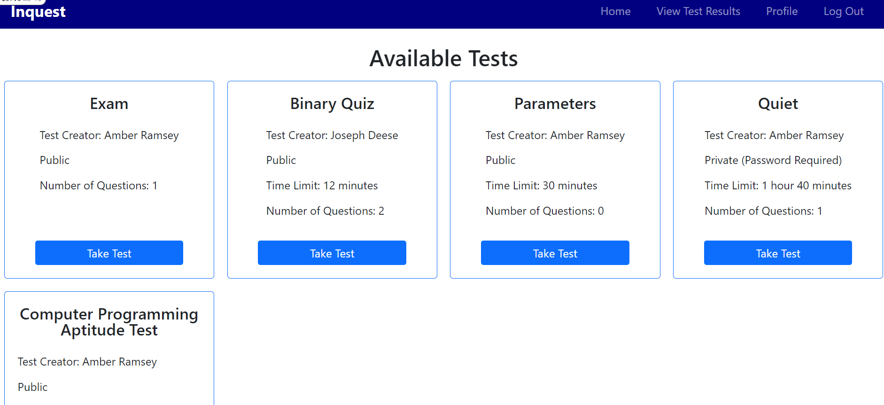

# Implementation

&nbsp;&nbsp;&nbsp;&nbsp;&nbsp;&nbsp;&nbsp;&nbsp;This project is a web application that allows admins to create tests and view results from the users. Some of the key features of this application are creating tests, questions, and users. Another essential feature is the ability for users to be able to take tests and store their responses in the database. This project was created with languages such as Ruby on Rails and Bootstrap. Some differences between admin and user accounts are that admin can promote users to become admins, they can create, edit, and delete tests and questions, and they can view test results for all users. User accounts can edit their profile information, take tests, and view their test results.

Log In Page

Create New Account

Admin Home Page

User Home Page

Profile

Edit Profile

List of Admins and Users

Create New Test

Create New Question

Edit Test

Edit Question

Test Information

Test Question

Link to Repository: https://github.com/amber-ramsey/Senior-Project